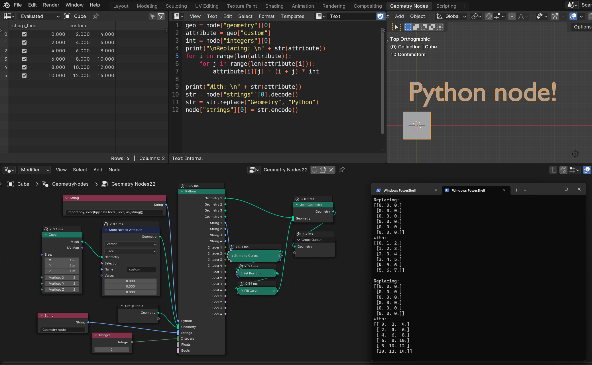
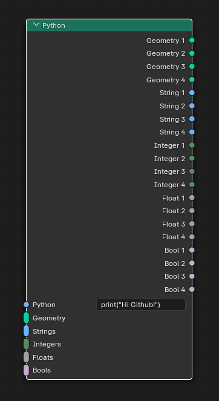
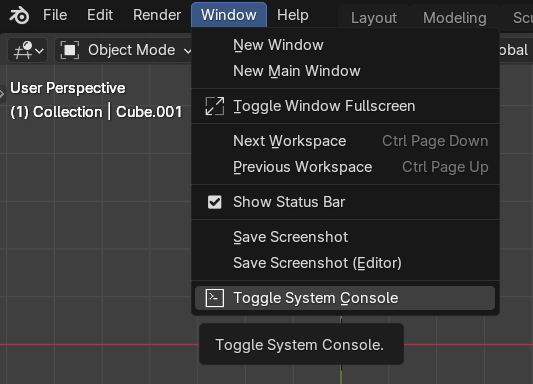
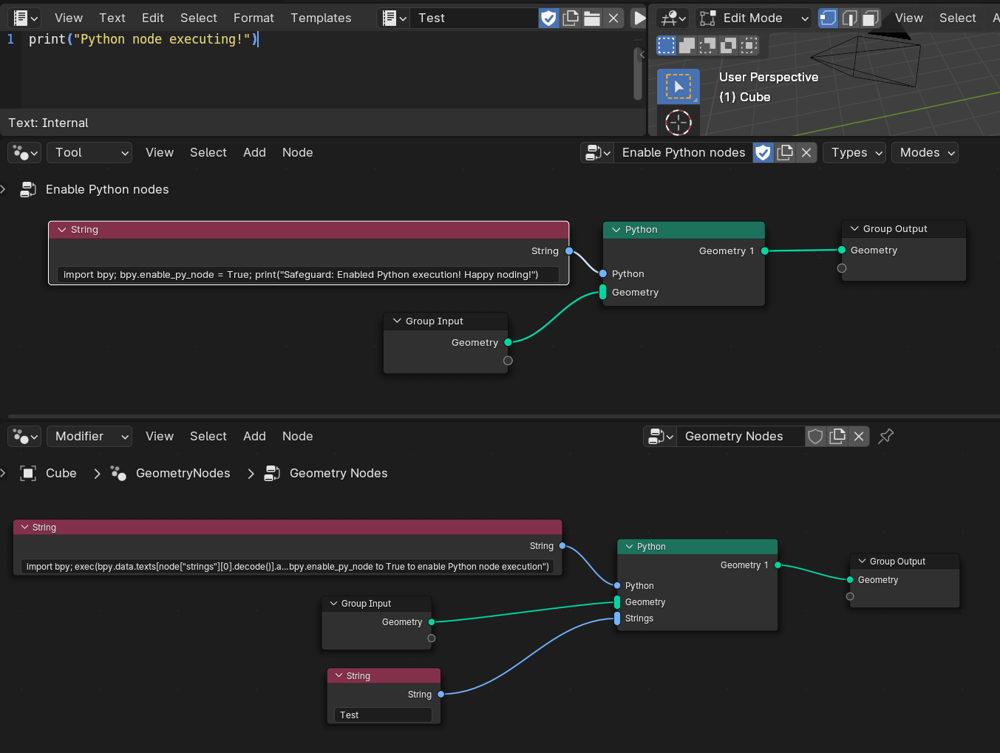

# Blender Python Geometry Node
This repository contains a Blender (4.3) fork that adds an experimental Python node to the geometry nodes system. This is a proof of concept and may be unstable.



# What does this do?
The Python node allows users to process geometry attributes and primitives, but **not** fields, using Python from within the geometry node system.
Because it is executed in the context of the active Blender program, importing the `bpy` module works, but is limited since the Python code is executed during the depsgraph evaluation.
This enables users to make Python nodes that prevent them from having remake things in geometry nodes while retaining the ease of use.



# How do you see the Python output?
To see the Python output such as print statements and errors you need the toggle the system console.
This is located at `Window->Toggle System Console`



MacOS does not have this button and will need Blender to be started from the Terminal. Example start command:
```
/Applications/Blender.app/Contents/MacOS/Blender
```

If MacOS says the app is damaged run the following command
```
xattr -d com.apple.quarantine /Applications/Blender.app
```

# How do you get the node?
The node is avaiable under `Utilities->Python`

# How do you use the node?
The Python node works with geometry attributes and primitives. 
The node can have many inputs but only outputs 4 of each input type.

For geometry attributes all attributes can be read and written to, with the exception of internal attributes such as `.edge_verts` which can only be read. Currently instance attributes cannot be read or written to.

The Python input is the Python string input that will get executed. It is recommended to us the following default string which will execute the text block corresponding to the first input string. It also has an execution safeguard that prevents execution until the `bpy.enable_py_node` variable is set to True. It is strongly advised to use this to prevent things like an accidental `exit()` call locking you out of the blend file.

Default string to use in the Python field one every node:
```
import bpy; exec(bpy.data.texts[node["strings"][0].decode()].as_string()) if hasattr(bpy, "enable_py_node") else print("Safeguard: Set bpy.enable_py_node to True to enable Python node execution")
```

After bpy.enable_py_node has been set to True the first String input is the name of the text block that will be executed.

To enable execution I put the following string in a geometry node tool:
```
import bpy; bpy.enable_py_node = True; print("Safeguard: Enabled Python execution! Happy noding!")
```
Then you can simply execute the tool and you will enable the Python node exution for nodes using the default string.

In the image below we can see the Tool to enable Python nodes in the upper geometry node editor. When enabled the geometry node modifier in the lower editor can have its Python node execute the text block named `Test`.


Inputs can be accessed as follows:

This gets the first input string.
```
node["strings"][0]
```

This gets the position of the tenth vertex of the third geometry input.
```
node["geometry"][2]["position"][9]
```

The object name the node is being executed on is stored at in utils.
Example of how to use:
```
# Get the name and strip the first 2 characters
obj_name = node["utils"][0].decode()[2:]
cube = bpy.data.objects[obj_name]
```


# How fast is the node?
It is of course not as fast as the C++ nodes, but very usable, around 0.20 - 0.30 milliseconds for a simple node.
Print statements can be quite slow. So avoid them if you are done debugging and need more speed.

# How safe is this?
If you are not careful you can absolutely crash or lock up Blender by using the Python node improperly (or I have bugs in the code). 

For example do not use `exit()` or an infinite loop. As this locks up the Blender UI because the Python context is the same. Safe often and any mistakes won't have a big impact. In bad cases you can even use Blenders restore feature.

Basically the same things as coding addons apply, with some geometry node based spice.

# Build notes
This build uses an edited numpy.

First download the Blender libraries with `make update`.

Then copy the following folder:
```
py-geonode-modified/numpy
```

To the location with your platform. (Such as windows_x64)
```
lib/{your_platform}/python/
```

Now you can use `make` (or `make.bat` on Windows) to build Blender.

## Post build

After you have built this repository add:
```
node_add_menu.add_node_type(layout, "GeometryNodePython")
```
to the class: 
```
NODE_MT_category_GEO_UTILITIES
```
in the file found here: 
```
4.3\scripts\startup\bl_ui\node_add_menu_geometry.py
```
Also add the numba package to the Blender Python install. This can potentially speed up pure Python (No `bpy`) functions with `@jit`.

```
.\4.3\python\bin\python.exe -m pip install numba
```

# Disclaimer
Not affiliated with Blender or the Blender foundation.

The stability of this code may vary. Please be mindful of that.

License
-------

Blender as a whole is licensed under the GNU General Public License, Version 3.
Individual files may have a different, but compatible license.

See [blender.org/about/license](https://www.blender.org/about/license) for details.
