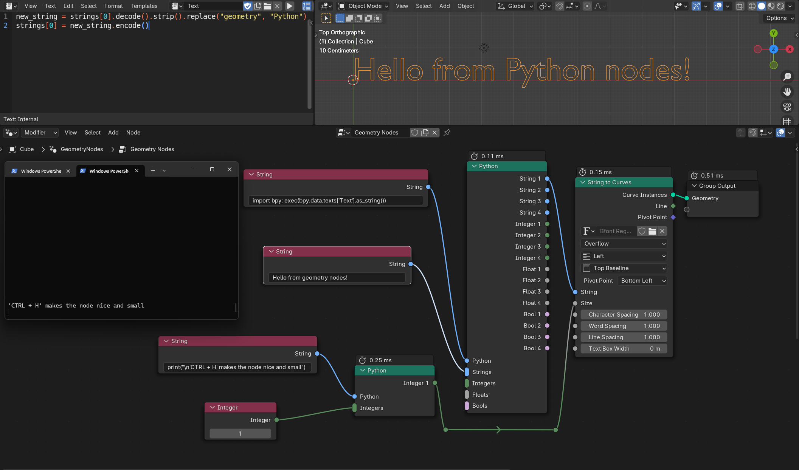
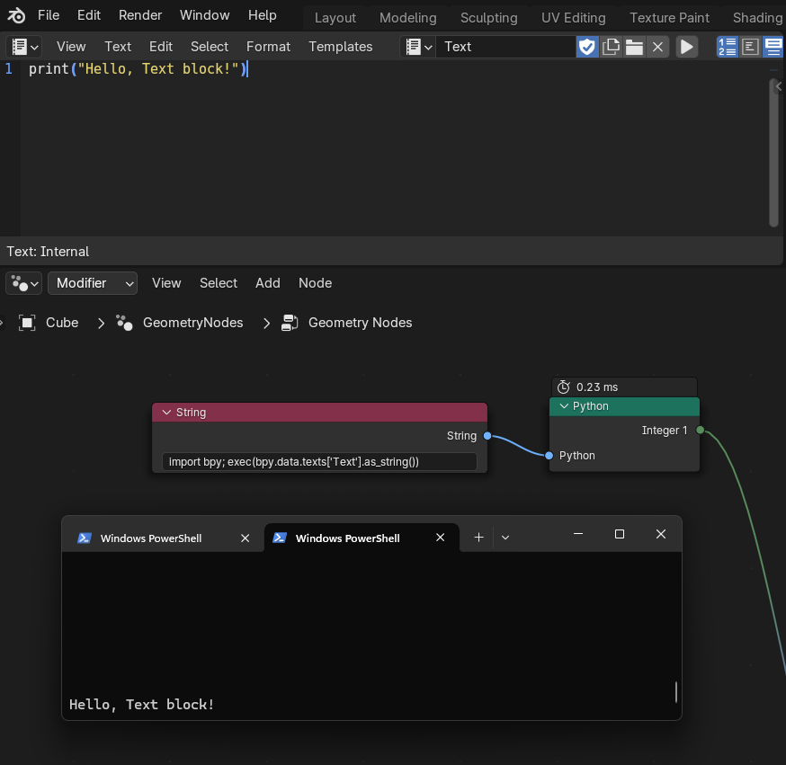

# Blender Python Geometry Node
This repository contains a Blender (4.1) fork that adds a Python node to the geometry nodes system.



# What does this do?
The Python node allows users to process primitives and execute Python code from the geometry node system.
Because it is executed in the context of the active Blender program, importing the `bpy` module gives the same access as the Blender console tab.
This enables users to make "custom" nodes that can do everything Python and the Blender Python API allow.

# How do you see the Python output?
To see the Python output such as print statements and errors it is recommended to start the program from the terminal.
You can do this on Windows by right clicking in the folder with the `Blender.exe` and select `open in terminal`
This should open a new terminal window where you can type `./Blender.exe` to start the program.
Now all errors and print statements can be seen in this terminal window.

# How do you get the node?
The node is avaiable under `Utilities->Python`

# How do you use the node?
The node only works with the following types:
- strings
- integers
- floats
- bools

The node can have many inputs but only outputs 4 of each type.

The Python input is the Python string input that will get executed. It is recommended to point it to a text data block for easier use.
Example using a text block named "Text":
```
import bpy; exec(bpy.data.texts['Text'].as_string())
```


The inputs are stored in the following Python lists:
- utils
- strings
- integers
- floats
- bools

The node name is stored at `utils[0]`
Strings are byte-strings and need to be decoded and encoded to use.
Strings have a buffer of 1024 characters and have trailing spaces for that reason. Simply use `.strip()` to remove them.

Example:
```
new_string = strings[0].decode().strip()
new_string.do_stuff()
strings[0] = new_string.encode()
```

# How fast is the node?
It is of course not as fast as the C++ nodes, but very usable, around 0.20 - 0.30 milliseconds.
Print statements can be quite slow. So avoid them if you are done debugging and need more speed.

Side note:
To get the timings to work the node type is geometry while not having any geometry inputs. This is the reason why it can break geometry lines but doesn't connect to them.

# Build notes
If you built this repository yourself don't forget to add 
```
node_add_menu.add_node_type(layout, "GeometryNodePython")
```
to the class: 
```
NODE_MT_category_GEO_UTILITIES
```
in the file found here: 
```
4.1\scripts\startup\bl_ui\node_add_menu_geometry.py
```

# Disclaimer
Not affiliated with Blender or the Blender foundation.

The stability of this code may vary. Please be mindful of that.

License
-------

Blender as a whole is licensed under the GNU General Public License, Version 3.
Individual files may have a different, but compatible license.

See [blender.org/about/license](https://www.blender.org/about/license) for details.
